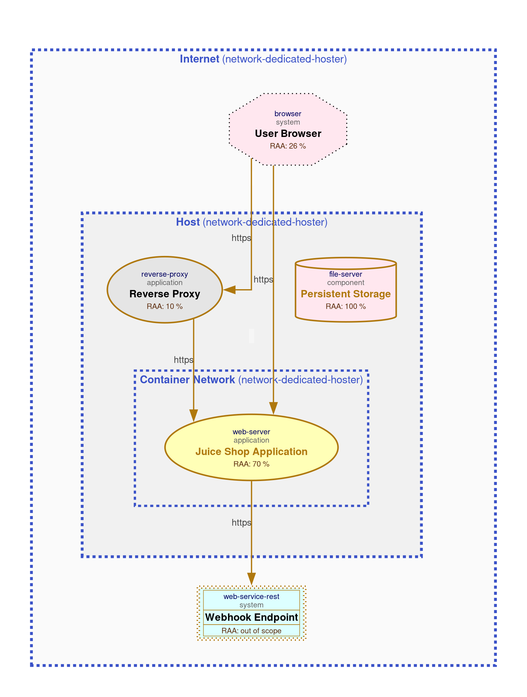

# Threagile Baseline Model

## Top 5 Risks

| Rank | Risk Category | Severity | Likelihood | Impact | Asset | Composite Score |
|------|---------------|----------|------------|--------|-------|-----------------|
| 1 | Unencrypted Communication | Elevated | Likely | High | User Browser → Juice Shop (Direct) | 433 |
| 2 | Cross-Site Scripting (XSS) | Elevated | Likely | Medium | Juice Shop Application | 432 |
| 3 | Unencrypted Communication | Elevated | Likely | Medium | Reverse Proxy → Juice Shop | 432 |
| 4 | Missing Authentication | Elevated | Likely | Medium | Reverse Proxy → Juice Shop | 432 |
| 5 | Cross-Site Request Forgery (CSRF) | Medium | Very-Likely | Low | Juice Shop Application | 241 |

## Critical Security Concerns

### Unencrypted Communication (Score: 433)
The most critical risk involves HTTP traffic between User Browser and Juice Shop when bypassing the reverse proxy. This exposes:
- Authentication tokens and session cookies in cleartext
- User credentials during login
- Personal data in transit (orders, profiles)

Impact: Attackers on the network can intercept sensitive data, leading to session hijacking and credential theft.

### Cross-Site Scripting - XSS (Score: 432)
Juice Shop is a deliberately vulnerable application with stored XSS vulnerabilities (e.g., in product reviews). Attackers can inject malicious scripts that execute in other users' browsers.

Impact: Session token theft, phishing, defacement, and malware distribution.

### Missing Authentication (Score: 432)
The internal communication between Reverse Proxy and Juice Shop lacks authentication. If the proxy is compromised or bypassed, direct access to the backend is possible.

Impact: Unauthorized access to backend APIs and data.

### CSRF Attacks (Score: 241)
Without proper CSRF tokens, attackers can trick authenticated users into executing unwanted actions (e.g., changing passwords, placing orders).

Impact: Unauthorized state changes on behalf of users.

## Diagrams


# HTTPS Variant & Risk Comparison

## Changes Made to Create Secure Variant

### Change 1: Direct User-to-App Connection
```yaml
# BEFORE
protocol: http

# AFTER
protocol: https
```
Rationale: Enforces TLS encryption for direct browser access, protecting credentials and session tokens.

### Change 2: Reverse Proxy-to-App Connection
```yaml
# BEFORE
protocol: http

# AFTER
protocol: https
```
Rationale: Encrypts internal traffic between proxy and backend, mitigating eavesdropping on the host network.

### Change 3: Persistent Storage Encryption
```yaml
# BEFORE
encryption: none

# AFTER
encryption: transparent
```
Rationale: Enables transparent encryption for the mounted volume containing the database and logs.

## Risk Category Delta Analysis

| Category | Baseline | Secure | Δ |
|---|---:|---:|---:|
| container-baseimage-backdooring | 1 | 1 | 0 |
| cross-site-request-forgery | 2 | 2 | 0 |
| cross-site-scripting | 1 | 1 | 0 |
| missing-authentication | 1 | 1 | 0 |
| missing-authentication-second-factor | 2 | 2 | 0 |
| missing-build-infrastructure | 1 | 1 | 0 |
| missing-hardening | 2 | 2 | 0 |
| missing-identity-store | 1 | 1 | 0 |
| missing-vault | 1 | 1 | 0 |
| missing-waf | 1 | 1 | 0 |
| server-side-request-forgery | 2 | 2 | 0 |
| **unencrypted-asset** | **2** | **1** | **-1** |
| **unencrypted-communication** | **2** | **0** | **-2** |
| unnecessary-data-transfer | 2 | 2 | 0 |
| unnecessary-technical-asset | 2 | 2 | 0 |

Total Risks: Baseline = 23, Secure = 20, Reduction = 3 risks (-13%)

## Analysis of Risk Reduction

### Eliminated Risks

1. Unencrypted Communication: User Browser → Juice Shop (Direct)
   - Original Severity: Elevated (Score: 433)
   - Mitigation: Changing protocol to HTTPS encrypts authentication tokens and sensitive data in transit
   - Business Impact: Prevents credential theft and session hijacking on untrusted networks

2. Unencrypted Communication: Reverse Proxy → Juice Shop
   - Original Severity: Elevated (Score: 432)  
   - Mitigation: Enforcing HTTPS internally protects against lateral movement attacks
   - Business Impact: Reduces blast radius if the proxy or host network is compromised

3. Unencrypted Asset: Persistent Storage
   - Original Severity: Medium (Score: 212)
   - Mitigation: Transparent encryption protects data at rest (database, logs, uploads)
   - Business Impact: Prevents data leaks from physical disk theft or improper disposal

### Diagram Comparison

The secure variant's data flow diagram shows the same architecture with protocol labels updated from HTTP to HTTPS on the relevant communication links.

Secure: 
